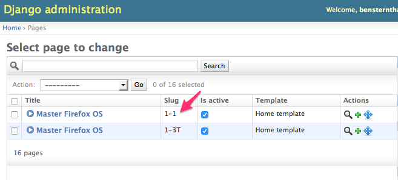

.. This Source Code Form is subject to the terms of the Mozilla Public
.. License, v. 2.0. If a copy of the MPL was not distributed with this
.. file, You can obtain one at http://mozilla.org/MPL/2.0/.

============
Key Concepts
============

Authentication
--------------

In order to author content in the MFOS site, you will need to login:

  1. Navigate to: **https://masterfirefoxos.mozilla.org/admin**)
  2. Supply the **username** (email) and **password**
  3. Press **Login**

FFOS Versions
-------------

All pages on masterfirefoxos (MFOSS) are associated with a version of Firefox OS. In the CMS this
is accomplished by having a seperate page tree for each version. The version of FFOS is denoted by
the slug, as shown below:

The slug will also appear in urls:

``https://www.masterfirefoxos.com/en/1-1/introduction/``

When adding a new FFOS version or locale changes must also be made by a developer to the settings
file. This is a once per version or locale change.

TinyMCE Editor
--------------

The TinyMCE editor is disabled for content entry. Unfortunately this editor
adds HTML formatting that causes problems for L10N.

.. warning::

   Generally you should not manually add html tags. If you do need to add html tags pleas
   restrict usage to <b>,   and basic formatting. Do not use tags like 
 or 
.

